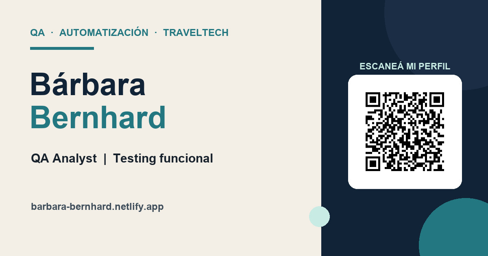

# Bárbara Bernhard — Landing profesional

[](https://github.com/Barbyland/barbara-bernhard-landing/actions/workflows/quality.yml)

> **QA Analyst | Automation Testing | TravelTech**

Landing personal desarrollada para presentar de forma clara y directa mi perfil profesional, experiencia, formación y proyectos con evidencia pública.

Combino más de 15 años de experiencia en operaciones turísticas y sistemas de reservas con formación técnica en programación, testing funcional y automatización. También aporto conocimientos de desarrollo Front-End para comprender los productos de manera integral.

**Sitio publicado:** [barbara-bernhard.netlify.app](https://barbara-bernhard.netlify.app/)

## Vista previa



## Objetivo

Facilitar que recruiters, empresas y contactos profesionales puedan conocer mi perfil en pocos segundos y acceder desde un único lugar a:

- Experiencia en QA funcional, Automation Testing y TravelTech.
- Proyectos técnicos y colaborativos con resultados verificables.
- LinkedIn, GitHub y portfolio de Barby Digital.
- CV público descargable sin teléfono ni información sensible.

## Decisiones de desarrollo

La landing utiliza **HTML5, CSS3 y JavaScript vanilla** porque es un sitio estático y no necesita la complejidad de un framework o un backend.

Esta elección permite:

- Carga rápida y pocas dependencias en producción.
- Código simple de mantener y desplegar.
- HTML semántico accesible desde el origen.
- Diseño responsive controlado mediante CSS.
- Interacciones progresivas sin depender de librerías externas.

JavaScript se utiliza solamente para el menú responsive, el manejo de estados accesibles y la actualización automática del año del footer.

## Proyectos destacados

### FARO

MVP de accesibilidad diseñado para integrarse con Moodle, desarrollado en el Equipo 13 de Innova Lab.

Mi aporte incluyó QA funcional y de accesibilidad, API Testing, documentación de evidencias, reporte y seguimiento de incidencias, retesting y desarrollo Front-End de la landing con demo interactiva.

### Automation Testing Framework

Framework modular de pruebas UI y API con Python, Selenium WebDriver, Pytest, Requests, Page Object Model, datos externos, logging, reportes y capturas automáticas ante fallos.

**Evidencia documentada:**

- 11 pruebas automatizadas aprobadas.
- 7 pruebas UI y 4 pruebas API.
- Integración continua con GitHub Actions.
- Reportes HTML, logs y capturas automáticas ante fallos.

### Otros proyectos

- **Sistema de Gestión de Inventario:** aplicación en Python y SQLite con validaciones y persistencia de datos.
- **Barby Digital:** diseño y desarrollo de sitios web responsive para emprendedores y pequeños negocios.

## Tecnologías

- HTML5 semántico.
- CSS3 y diseño responsive.
- JavaScript vanilla.
- Git, GitHub y GitHub Actions.
- Netlify para despliegue continuo.

Los proyectos enlazados desde la landing también incorporan Python, SQLite, Selenium WebDriver, Pytest, Requests y Page Object Model.

## Accesibilidad y calidad

El desarrollo contempla:

- Navegación por teclado y foco visible.
- Enlace para saltar al contenido principal.
- Jerarquía semántica de encabezados.
- Etiquetas y estados ARIA en la navegación móvil.
- Compatibilidad con `prefers-reduced-motion`.
- Imágenes optimizadas y textos alternativos.
- Adaptación responsive para celular, tablet y escritorio.
- Encabezados de seguridad y políticas de caché configurados en Netlify.

El workflow de calidad ejecuta automáticamente:

1. Validación estructural del documento con **HTML Validate**.
2. Auditoría automatizada de accesibilidad **WCAG 2 AA** con **Pa11y CI**.

Estas comprobaciones automáticas complementan, pero no reemplazan, la revisión manual con teclado, lectores de pantalla y dispositivos reales.

## Estructura

```text
.
├── .github/workflows/quality.yml
├── assets/
│   ├── Barbara_Bernhard_CV_QA_2026_publico_sin_telefono.pdf
│   ├── barbara-bernhard.webp
│   └── barbara-bernhard-share-v2.jpg
├── .htmlvalidate.json
├── .pa11yci
├── index.html
├── netlify.toml
├── script.js
├── styles.css
└── README.md
```

## Ejecutar localmente

Desde la carpeta del proyecto:

```powershell
python -m http.server 8000
```

Luego visitar `http://localhost:8000`.

### Ejecutar las validaciones

Validar el HTML:

```powershell
npx --yes html-validate@11.5.6 index.html
```

Para la prueba de accesibilidad, iniciar el servidor en el puerto 8080:

```powershell
python -m http.server 8080
```

Y, desde otra terminal:

```powershell
npx --yes pa11y-ci@4.1.1 --config .pa11yci
```

## Despliegue

La rama principal se publica automáticamente en Netlify. Cada `push` o `pull request` también activa el workflow de calidad en GitHub Actions.

## Contacto

- [LinkedIn](https://www.linkedin.com/in/barbara-bernhard/)
- [GitHub](https://github.com/Barbyland)
- [Portfolio Barby Digital](https://barby-digital-web.netlify.app/)
- [barby.bernhard@gmail.com](mailto:barby.bernhard@gmail.com)

---

Desarrollado por **Bárbara Bernhard** · Buenos Aires, Argentina · 2026
